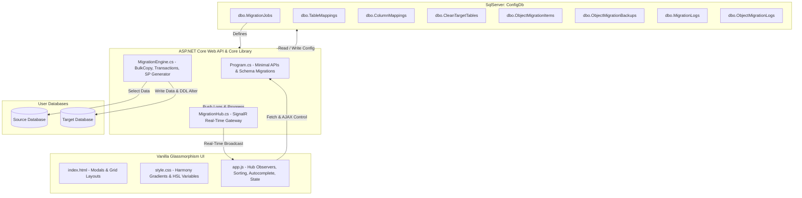

# 🤖 AI Technical Blueprint & System Map (Token-Optimized)
**Project:** DbMigrator (.NET 8 & Vanilla Glassmorphism FE)  
**Target:** High-Speed Codebase Ingestion, Ultra-Low Token Consumption, Multi-Agent Coordination.  

---

## 📌 1. Core Architecture Blueprint
An extremely dense visual representation of the overall architecture:



---

## 📂 2. File Mapping & High-Density Code Index

### 🔹 C# Core Class Library (`DbMigrator.Core`)
*   **[Models.cs](file:///d:/Rasimin/Learn/HIbankQNB/DbMigrator.Core/Models.cs)**: Data models defining `MigrationJob`, `TableMapping`, `ColumnMapping`, `CleanTargetTable`, `ObjectMigrationItem`, `ObjectMigrationBackup`, `ObjectMigrationLog`, and `MigrationLog`.
*   **[MigrationEngine.cs](file:///d:/Rasimin/Learn/HIbankQNB/DbMigrator.Core/MigrationEngine.cs)**: Core data migrator logic.
    *   `RunJobAsync(jobId, onProgress, token, mappingId)`: Orchestrates table iterations, handles **Done-Skipping**, and executes SP commands.
    *   `ExecuteTableMappingAsync()`: Runs bulk copy operations inside isolated target database transactions (`SqlTransaction`).
    *   `ConvertValue(val, type)`: Secure dynamic data conversion mapping to target database columns.

### 🔹 ASP.NET Core Web Project (`DbMigrator.Web`)
*   **[Program.cs](file:///d:/Rasimin/Learn/HIbankQNB/DbMigrator.Web/Program.cs)**: Startup configuration, DDL migrations, and Minimal API routes.
    *   *Startup Migrations (L141-L282)*: Dynamically alters and checks configurator table schemas (`dbo.CleanTargetTables`, `dbo.TableMappings`, `dbo.ObjectMigrationItems` with status columns `LastStatus`, `LastErrorMessage`, `LastRunAt`).
    *   *SignalR Hub Mapping (L937)*: Connects SignalR client websocket traffic to `/migrationHub`.
*   **[MigrationHub.cs](file:///d:/Rasimin/Learn/HIbankQNB/DbMigrator.Web/MigrationHub.cs)**: Standard SignalR hub managing real-time websocket groups (`JobGroup_{jobId}`) to prevent progress data collisions.

### 🔹 Frontend Client Assets (`DbMigrator.Web/wwwroot/`)
*   **[index.html](file:///d:/Rasimin/Learn/HIbankQNB/DbMigrator.Web/wwwroot/index.html)**: Main HTML dashboard. Contains three primary vertical tabs (book tabs): `inner-tab-data` (Data Migration), `inner-tab-object` (Object Migration), and `inner-tab-clean` (Clean Target Table).
*   **[style.css](file:///d:/Rasimin/Learn/HIbankQNB/DbMigrator.Web/wwwroot/style.css)**: Modern premium Glassmorphism design sheet. Implements custom variables and status badges classes (`.badge-clean.pending`, `.completed`, `.inprogress`, `.failed`).
*   **[app.js](file:///d:/Rasimin/Learn/HIbankQNB/DbMigrator.Web/wwwroot/app.js)**: Orchestrates client states, AJAX REST API requests, drag-and-drop sortable lists, autocomplete table drop-downs, SignalR progressive UI bindings, single plays, and status resets.

---

## 🗄️ 3. Config Database Schema Map (`ConfigDb`)
```sql
-- Jobs Config
dbo.MigrationJobs (Id INT PK, JobName NVARCHAR, SourceConnectionString NVARCHAR, TargetConnectionString NVARCHAR, PostMigrationScript NVARCHAR)

-- Data Table Mappings
dbo.TableMappings (Id INT PK, JobId INT FK, SourceTableName NVARCHAR, TargetTableName NVARCHAR, ExecutionOrder INT, TruncateTarget BIT, IsEnabled BIT, MappingMode NVARCHAR, NativeSqlScript NVARCHAR, PostMigrationScript NVARCHAR, LastStatus NVARCHAR, LastErrorMessage NVARCHAR, LastRunAt DATETIME)

-- Column Mappings Detail
dbo.ColumnMappings (Id INT PK, TableMappingId INT FK, SourceColumnName NVARCHAR, TargetColumnName NVARCHAR, MappingType NVARCHAR, ConstantValue NVARCHAR, LookupTable NVARCHAR, LookupKeyColumn NVARCHAR, LookupValueColumn NVARCHAR, ExpressionSQL NVARCHAR)

-- Clean Target Table Config
dbo.CleanTargetTables (Id INT PK, JobId INT FK, TableName NVARCHAR, ExecutionOrder INT, LastStatus NVARCHAR, LastErrorMessage NVARCHAR, LastCleanedAt DATETIME)

-- DDL Object Migration Items
dbo.ObjectMigrationItems (Id INT PK, JobId INT FK, ObjectName NVARCHAR, ObjectType NVARCHAR, NativeSqlScript NVARCHAR, ExecutionOrder INT, IsEnabled BIT, LastStatus NVARCHAR, LastErrorMessage NVARCHAR, LastRunAt DATETIME)
```

---

## 📡 4. REST API Endpoint Catalog

| Method | Endpoint | Description | Query Parameters / Payload |
| :--- | :--- | :--- | :--- |
| **GET** | `/api/jobs` | Retrieve all migration jobs | - |
| **GET** | `/api/jobs/{id}` | Retrieve detailed configuration of a specific job | - |
| **POST** | `/api/jobs` | Create or update a migration job configuration | `MigrationJob` JSON |
| **DELETE**| `/api/jobs/{id}` | Delete job along with all associated mappings | - |
| **POST** | `/api/jobs/test-connection`| Test dynamic raw connection strings | `{ ConnectionString: "..." }` |
| **GET** | `/api/mappings/tables/{jobId}`| Retrieve all table mappings for a job | - |
| **POST** | `/api/mappings/tables/{jobId}/reorder`| Save custom drag-and-drop sequence orders | `List<ReorderItemDto>` |
| **POST** | `/api/mappings/tables` | Add or update a table mapping config | `TableMapping` JSON |
| **DELETE**| `/api/mappings/tables/{id}` | Delete a table mapping and column designs | - |
| **GET** | `/api/mappings/columns/{mapId}`| Retrieve designed column configurations | - |
| **POST** | `/api/mappings/columns/{mapId}`| Save column designs (Bulk replace/re-create) | `List<ColumnMapping>` JSON |
| **GET** | `/api/mappings/tables/{id}/generate-sp`| Generate manual Stored Procedure for the mapping | - |
| **GET** | `/api/db/tables` | Retrieve all base tables from source/target dynamically | `jobId`, `dbType` |
| **GET** | `/api/db/columns` | Retrieve column details for a table dynamically | `jobId`, `dbType`, `tableName` |
| **POST** | `/api/jobs/{id}/run` | Execute data migration job (mass or single mapping) | `mappingId` (Optional query parameter) |
| **POST** | `/api/jobs/{id}/cancel` | Terminate running background data migrations | - |
| **POST** | `/api/jobs/{jobId}/mappings/reset-status`| Reset all table mappings status to Pending | - |
| **GET** | `/api/jobs/{id}/obj-scan` | Scan SPs, Functions, Views, and Tables from Source DB | - |
| **GET** | `/api/jobs/{id}/obj-items`| Retrieve DDL migration items registered | - |
| **POST** | `/api/jobs/{id}/obj-items/reorder`| Save drag-and-drop DDL object sequence | `List<ReorderItemDto>` |
| **POST** | `/api/obj-items` | Add or update a DDL object migration item | `ObjectMigrationItem` JSON |
| **POST** | `/api/jobs/{id}/obj-items/bulk`| Bulk add DDL objects from scanner results | `List<ObjectMigrationItem>` JSON |
| **DELETE**| `/api/obj-items/{id}` | Delete registered DDL object migration item | - |
| **GET** | `/api/obj-items/{id}/backups`| Retrieve automated backup versions of an object | - |
| **GET** | `/api/obj-backups/{id}/download`| Download backup script as `.sql` file | - |
| **POST** | `/api/jobs/{id}/obj-run` | Run DDL object migration (mass or single item) | `itemId` (Optional query parameter) |
| **POST** | `/api/jobs/{jobId}/obj-items/reset-status`| Reset all DDL objects status to Pending | - |
| **GET** | `/api/jobs/{jobId}/clean-tables`| Retrieve clean tables registered | - |
| **POST** | `/api/jobs/{jobId}/clean-tables`| Register clean table (Supports comma bulk insert) | `{ TableNames: "TableA,TableB" }` |
| **DELETE**| `/api/clean-tables/{id}` | Remove a table from the clean list | - |
| **POST** | `/api/jobs/{jobId}/clean-tables/reorder`| Save clean table sequence orders | `List<ReorderItemDto>` |
| **POST** | `/api/jobs/{jobId}/clean-tables/run`| Execute table cleanup (mass or single table) | `id` (Optional query parameter) |
| **GET** | `/api/jobs/{jobId}/clean-tables/generate-sp`| Generate single SP containing all clean codes | - |
| **POST** | `/api/jobs/{jobId}/clean-tables/reset-status`| Reset all clean tables status to Pending | - |

---

## 📡 5. SignalR Broadcast Events
Real-time progress broadcast format for `/migrationHub`:

```javascript
// 1. Group Joining: Client automatically invokes on active selection:
connection.invoke("JoinJobGroup", jobId.toString())

// 2. Real-Time progress receiver (Payload normalization):
connection.on('ReceiveProgress', (progressData) => {
    // Normalizes: JobId, TableName, TotalRows, RowsMigrated, Status (InProgress, Completed, Failed), ErrorMessage
})

// 3. Global Job Error receiver:
connection.on('ReceiveError', (errorObj) => {
    // Normalizes: JobId, Message
})
```

---

## 💾 6. Frontend JS State Management (`app.js`)
*   `activeJob`: Currently selected Job configuration object. Properties: `Id`/`id`, `JobName`/`jobName`, `SourceConnectionString`, `TargetConnectionString`.
*   `sourceTables` & `targetTables`: Active database table list cache arrays.
*   `sourceColumnsCache` & `targetColumnsCache`: Dictionaries for column schema metadata: `tableName -> list of { Name, Type }`.
*   `activeTableMappingId`: Currently opened column designer target mapping ID.

---

## 🔄 7. DYNAMIC REGISTRY OF NEW FEATURES
*Subsequent AIs or agents **MUST** log any new feature here to keep this map strictly up to date. Keep entries highly descriptive, exact, and concise.*

### 🛠️ F-01: Status Resets, Done-Skipping, & Single Plays
*   **Status Resets:** Implemented dynamic reset status endpoints in Minimal API routes (`Program.cs`) and triggered via `resetDataStatuses()`, `resetObjStatuses()`, and `resetCleanStatuses()` in `app.js` with `fa-undo` UI buttons. Clears states, logs, and dates.
*   **Done-Skipping:** Added database bypass check in `MigrationEngine.RunJobAsync()` (L742), `/api/jobs/{id}/obj-run` (L1107), and `/api/jobs/{jobId}/clean-tables/run` (L1338). Skips processing if current status is `"Completed"`. Reports skipped counts inside summary popups in frontend client.
*   **Single play:** Implemented individual play triggers (`runSingleMapping(mapId)`, `runSingleObjItem(itemId)`, and `runSingleClean(id)`) acting independently, which forces execution regardless of whether it is `"Completed"`.

---

## 📖 8. Essential Rules for AI Agent Development
When you are tasked with fixing bugs or adding features to this repository:
1.  **Check startup alters:** Ensure any schema changes are appended directly inside `Program.cs` under the *Startup Migrations* section to enforce automatic updates on runtime start.
2.  **Maintain property name cases:** C# JSON serialization preserves C# class casing (PascalCase). Always retrieve fields defensively using double checks in JS (e.g. `obj.PropertyName || obj.propertyName`).
3.  **Respect external documentation preference:** All created markdown documentation **MUST** be written both to the Brain artifacts directory and exported to `D:\Rasimin\DocumentationAI\HIbankQNB\` directory.
4.  **Update this Blueprint:** If you add a new route, model property, or component, **you must immediately update this blueprint and log it inside Section 7 (Dynamic Registry of New Features)**.
