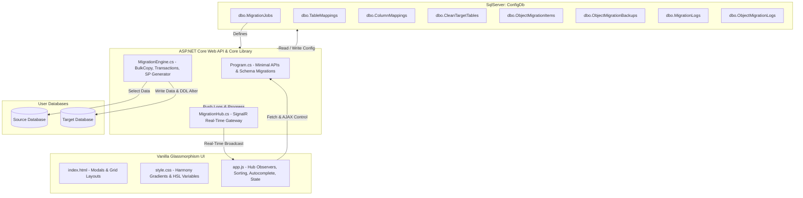

# 🤖 AI Technical Blueprint & System Map (Token-Optimized)
**Project:** DbMigrator (.NET 8 & Vanilla Glassmorphism FE)  
**Target:** High-Speed Codebase Ingestion, Ultra-Low Token Consumption, Multi-Agent Coordination.  

---

## 📌 1. Core Architecture Blueprint
An extremely dense visual representation of the overall architecture:



---

## 📂 2. File Mapping & High-Density Code Index

### 🔹 C# Core Class Library (`DbMigrator.Core`)
*   **[Models.cs](file:///d:/Rasimin/Learn/HIbankQNB/DbMigrator.Core/Models.cs)**: Data models defining `MigrationJob`, `TableMapping`, `ColumnMapping`, `CleanTargetTable`, `ObjectMigrationItem`, `ObjectMigrationBackup`, `ObjectMigrationLog`, and `MigrationLog`.
*   **[MigrationEngine.cs](file:///d:/Rasimin/Learn/HIbankQNB/DbMigrator.Core/MigrationEngine.cs)**: Core data migrator logic.
    *   `RunJobAsync(jobId, onProgress, token, mappingId)`: Orchestrates table iterations, handles **Done-Skipping**, and executes SP commands.
    *   `ExecuteTableMappingAsync()`: Runs bulk copy operations inside isolated target database transactions (`SqlTransaction`).
    *   `ConvertValue(val, type)`: Secure dynamic data conversion mapping to target database columns.

### 🔹 ASP.NET Core Web Project (`DbMigrator.Web`)
*   **[Program.cs](file:///d:/Rasimin/Learn/HIbankQNB/DbMigrator.Web/Program.cs)**: Startup configuration, DDL migrations, and Minimal API routes.
    *   *Startup Migrations (L141-L282)*: Dynamically alters and checks configurator table schemas (`dbo.CleanTargetTables`, `dbo.TableMappings`, `dbo.ObjectMigrationItems` with status columns `LastStatus`, `LastErrorMessage`, `LastRunAt`).
    *   *SignalR Hub Mapping (L937)*: Connects SignalR client websocket traffic to `/migrationHub`.
*   **[MigrationHub.cs](file:///d:/Rasimin/Learn/HIbankQNB/DbMigrator.Web/MigrationHub.cs)**: Standard SignalR hub managing real-time websocket groups (`JobGroup_{jobId}`) to prevent progress data collisions.

### 🔹 Frontend Client Assets (`DbMigrator.Web/wwwroot/`)
*   **[index.html](file:///d:/Rasimin/Learn/HIbankQNB/DbMigrator.Web/wwwroot/index.html)**: Main HTML dashboard. Contains three primary vertical tabs (book tabs): `inner-tab-data` (Data Migration), `inner-tab-object` (Object Migration), and `inner-tab-clean` (Clean Target Table).
*   **[style.css](file:///d:/Rasimin/Learn/HIbankQNB/DbMigrator.Web/wwwroot/style.css)**: Modern premium Glassmorphism design sheet. Implements custom variables and status badges classes (`.badge-clean.pending`, `.completed`, `.inprogress`, `.failed`).
*   **[app.js](file:///d:/Rasimin/Learn/HIbankQNB/DbMigrator.Web/wwwroot/app.js)**: Orchestrates client states, AJAX REST API requests, drag-and-drop sortable lists, autocomplete table drop-downs, SignalR progressive UI bindings, single plays, and status resets.

---

## 🗄️ 3. Config Database Schema Map (`ConfigDb`)
```sql
-- Jobs Config
dbo.MigrationJobs (Id INT PK, JobName NVARCHAR, SourceConnectionString NVARCHAR, TargetConnectionString NVARCHAR, PostMigrationScript NVARCHAR)

-- Data Table Mappings
dbo.TableMappings (Id INT PK, JobId INT FK, SourceTableName NVARCHAR, TargetTableName NVARCHAR, ExecutionOrder INT, TruncateTarget BIT, IsEnabled BIT, MappingMode NVARCHAR, NativeSqlScript NVARCHAR, PostMigrationScript NVARCHAR, LastStatus NVARCHAR, LastErrorMessage NVARCHAR, LastRunAt DATETIME)

-- Column Mappings Detail
dbo.ColumnMappings (Id INT PK, TableMappingId INT FK, SourceColumnName NVARCHAR, TargetColumnName NVARCHAR, MappingType NVARCHAR, ConstantValue NVARCHAR, LookupTable NVARCHAR, LookupKeyColumn NVARCHAR, LookupValueColumn NVARCHAR, ExpressionSQL NVARCHAR)

-- Clean Target Table Config
dbo.CleanTargetTables (Id INT PK, JobId INT FK, TableName NVARCHAR, ExecutionOrder INT, LastStatus NVARCHAR, LastErrorMessage NVARCHAR, LastCleanedAt DATETIME)

-- DDL Object Migration Items
dbo.ObjectMigrationItems (Id INT PK, JobId INT FK, ObjectName NVARCHAR, ObjectType NVARCHAR, NativeSqlScript NVARCHAR, ExecutionOrder INT, IsEnabled BIT, LastStatus NVARCHAR, LastErrorMessage NVARCHAR, LastRunAt DATETIME)
```

---

## 📡 4. REST API Endpoint Catalog

| Method | Endpoint | Description | Query Parameters / Payload |
| :--- | :--- | :--- | :--- |
| **GET** | `/api/jobs` | Retrieve all migration jobs | - |
| **GET** | `/api/jobs/{id}` | Retrieve detailed configuration of a specific job | - |
| **POST** | `/api/jobs` | Create or update a migration job configuration | `MigrationJob` JSON |
| **DELETE**| `/api/jobs/{id}` | Delete job along with all associated mappings | - |
| **POST** | `/api/jobs/test-connection`| Test dynamic raw connection strings | `{ ConnectionString: "..." }` |
| **GET** | `/api/mappings/tables/{jobId}`| Retrieve all table mappings for a job | - |
| **POST** | `/api/mappings/tables/{jobId}/reorder`| Save custom drag-and-drop sequence orders | `List<ReorderItemDto>` |
| **POST** | `/api/mappings/tables` | Add or update a table mapping config | `TableMapping` JSON |
| **DELETE**| `/api/mappings/tables/{id}` | Delete a table mapping and column designs | - |
| **GET** | `/api/mappings/columns/{mapId}`| Retrieve designed column configurations | - |
| **POST** | `/api/mappings/columns/{mapId}`| Save column designs (Bulk replace/re-create) | `List<ColumnMapping>` JSON |
| **GET** | `/api/mappings/tables/{id}/generate-sp`| Generate manual Stored Procedure for the mapping | - |
| **GET** | `/api/db/tables` | Retrieve all base tables from source/target dynamically | `jobId`, `dbType` |
| **GET** | `/api/db/columns` | Retrieve column details for a table dynamically | `jobId`, `dbType`, `tableName` |
| **POST** | `/api/jobs/{id}/run` | Execute data migration job (mass or single mapping) | `mappingId` (Optional query parameter) |
| **POST** | `/api/jobs/{id}/cancel` | Terminate running background data migrations | - |
| **POST** | `/api/jobs/{jobId}/mappings/reset-status`| Reset all table mappings status to Pending | - |
| **GET** | `/api/jobs/{id}/obj-scan` | Scan SPs, Functions, Views, and Tables from Source DB | - |
| **GET** | `/api/jobs/{id}/obj-items`| Retrieve DDL migration items registered | - |
| **POST** | `/api/jobs/{id}/obj-items/reorder`| Save drag-and-drop DDL object sequence | `List<ReorderItemDto>` |
| **POST** | `/api/obj-items` | Add or update a DDL object migration item | `ObjectMigrationItem` JSON |
| **POST** | `/api/jobs/{id}/obj-items/bulk`| Bulk add DDL objects from scanner results | `List<ObjectMigrationItem>` JSON |
| **DELETE**| `/api/obj-items/{id}` | Delete registered DDL object migration item | - |
| **GET** | `/api/obj-items/{id}/backups`| Retrieve automated backup versions of an object | - |
| **GET** | `/api/obj-backups/{id}/download`| Download backup script as `.sql` file | - |
| **POST** | `/api/jobs/{id}/obj-run` | Run DDL object migration (mass or single item) | `itemId` (Optional query parameter) |
| **POST** | `/api/jobs/{jobId}/obj-items/reset-status`| Reset all DDL objects status to Pending | - |
| **GET** | `/api/jobs/{jobId}/clean-tables`| Retrieve clean tables registered | - |
| **POST** | `/api/jobs/{jobId}/clean-tables`| Register clean table (Supports comma bulk insert) | `{ TableNames: "TableA,TableB" }` |
| **DELETE**| `/api/clean-tables/{id}` | Remove a table from the clean list | - |
| **POST** | `/api/jobs/{jobId}/clean-tables/reorder`| Save clean table sequence orders | `List<ReorderItemDto>` |
| **POST** | `/api/jobs/{jobId}/clean-tables/run`| Execute table cleanup (mass or single table) | `id` (Optional query parameter) |
| **GET** | `/api/jobs/{jobId}/clean-tables/generate-sp`| Generate single SP containing all clean codes | - |
| **POST** | `/api/jobs/{jobId}/clean-tables/reset-status`| Reset all clean tables status to Pending | - |

---

## 📡 5. SignalR Broadcast Events
Real-time progress broadcast format for `/migrationHub`:

```javascript
// 1. Group Joining: Client automatically invokes on active selection:
connection.invoke("JoinJobGroup", jobId.toString())

// 2. Real-Time progress receiver (Payload normalization):
connection.on('ReceiveProgress', (progressData) => {
    // Normalizes: JobId, TableName, TotalRows, RowsMigrated, Status (InProgress, Completed, Failed), ErrorMessage
})

// 3. Global Job Error receiver:
connection.on('ReceiveError', (errorObj) => {
    // Normalizes: JobId, Message
})
```

---

## 💾 6. Frontend JS State Management (`app.js`)
*   `activeJob`: Currently selected Job configuration object. Properties: `Id`/`id`, `JobName`/`jobName`, `SourceConnectionString`, `TargetConnectionString`.
*   `sourceTables` & `targetTables`: Active database table list cache arrays.
*   `sourceColumnsCache` & `targetColumnsCache`: Dictionaries for column schema metadata: `tableName -> list of { Name, Type }`.
*   `activeTableMappingId`: Currently opened column designer target mapping ID.
*   `dataMappingsCache`, `objItemsCache` & `cleanTablesCache`: Memory registries storing the raw server-fetched JSON configurations to enable high-speed client-side filtering.
*   `migrationTotalTables`: Count of enabled tables in the active migration run (mass or single mapping).
*   `migrationProcessedTables`: Dynamic status lookup map (`TableName -> Status`) storing processed tables in the current run session to compute global completion percentage.

---

## 🔄 7. DYNAMIC REGISTRY OF NEW FEATURES
*Subsequent AIs or agents **MUST** log any new feature here to keep this map strictly up to date. Keep entries highly descriptive, exact, and concise.*

### 🛠️ F-01: Status Resets, Done-Skipping, & Single Plays
*   **Status Resets:** Implemented dynamic reset status endpoints in Minimal API routes (`Program.cs`) and triggered via `resetDataStatuses()`, `resetObjStatuses()`, and `resetCleanStatuses()` in `app.js` with `fa-undo` UI buttons. Clears states, logs, and dates.
*   **Done-Skipping:** Added database bypass check in `MigrationEngine.RunJobAsync()` (L742), `/api/jobs/{id}/obj-run` (L1107), and `/api/jobs/{jobId}/clean-tables/run` (L1338). Skips processing if current status is `"Completed"`. Reports skipped counts inside summary popups in frontend client.
*   **Single play:** Implemented individual play triggers (`runSingleMapping(mapId)`, `runSingleObjItem(itemId)`, and `runSingleClean(id)`) acting independently, which forces execution regardless of whether it is `"Completed"`.

### 🛠️ F-02: Instant Client-Side Search, Dropdown Filtering, & Drag-and-Drop Sort locks
*   **High-Speed Caching:** Grid data is fetched once from server and stored in client-side arrays (`dataMappingsCache`, `objItemsCache`, and `cleanTablesCache`) to eliminate rendering lag during user search queries.
*   **Multi-Grid Input Searching:** Integrated instant text query searching (`oninput` on `#data-search`, `#obj-search`, `#clean-search`) filtering by origin/destination tables or object names.
*   **Multi-Grid Dropdown Filters:** Integrated dropdown-selectors (`onchange` on `#data-filter-status`, `#obj-filter-type`, `#obj-filter-status`, `#clean-filter-status`) enabling multi-dimensional state-filtering (All, Table, Procedure, View, Native SQL and Pending, InProgress, Completed, Failed).
*   **Dynamic Sortable Lock Safeguards:** Drag-and-drop elements initialize with `draggable="true"` and drag-handles enabled only when no query search/filters are active. The moment any filter triggers, grid elements instantly transition to `draggable="false"` with drag-handles hidden to protect execution index (`ExecutionOrder`) integrity and avoid corruption.
*   **Usability Grip-Handle Restriction:** The entire row container is set to `draggable="false"` by default to ensure browser standard text blocking/highlighting and copying work perfectly (e.g., to copy partial error logs). Dragging is dynamically enabled (`draggable="true"`) only when `mousedown` occurs directly on the left drag-handle icon and disabled back on release.

### 🛠️ F-03: Unified Progress Dashboard
*   **Anti-Clutter Layout Refactor:** Replaced the legacy stacked list of individual progress bars (which overflowed and cluttered the screen during large-scale runs) with a static, clean, glassmorphic dual-bar dashboard.
*   **Global Table Progress Card:** Displays `#global-progress-card` representing total tables successfully processed or skipped in real-time vs. overall tables (`X / Y Tables (Z%)`), using `#global-progress-bar`.
*   **Active Table Progress Card:** Displays `#active-table-progress-card` with `#active-table-bar` showing dynamic row-by-row throughput (`A / B Rows (C%)`) of the current active table, seamlessly transitioning as the runner moves to the next table.
*   **Dual Single & Mass Adaptability:** JavaScript logic automatically handles mass run total sizing based on `dataMappingsCache` active filters and defaults single mapping runs to `1` table, providing unified, elegant layout compliance under all scenarios.

### 🛠️ F-04: Top Navigation Bar & Multi-Screen Dashboard Tabs
*   **Top Navigation Bar:** Added `<nav class="top-nav">` with `.nav-item` elements (Migration, Schema Comparison, Query Console, Settings) styled with modern flat Glassmorphism layout.
*   **Tab Switching Logic:** Implemented `switchMainTab(tabId)` in `app.js` and `.main-screen` wrappers in `index.html` to toggle views.
*   **Mock Screens:** Added interactive mock implementations for Schema Comparison stat cards & grid, Query Console T-SQL editor & data tables, and Settings panel linked with `localStorage`.

### 🛠️ F-05: SSMS-Lite Query Console Autocomplete
*   **Complete Schema Ingestion:** Added `/api/db/schema` in `Program.cs` to return all tables, views, stored procedures, functions, and columns in a single, token-efficient query.
*   **Autocomplete UI & Engine:** Implemented real-time token tracking in `app.js` using Monaco's completion item providers to suggest T-SQL keywords, schema objects, and specific columns (supporting table-dot notation like `Customers.Name`).
*   **Schema Preloading:** Caches schema structures on loading the Query Console tab or connection change with a visual `#query-schema-loader` loading indicator to keep typing execution lag-free.

### 🛠️ F-06: Monaco Editor Integration (Offline)
*   **Offline Local Asset Storage:** Due to environment constraints blocking npm installation scripts on target environments, the minified Monaco Editor package (`v0.39.0`) was programmatically downloaded and placed locally at `DbMigrator.Web/wwwroot/lib/monaco-editor/min/vs`.
*   **Offline Loader Integration:** Linked in `index.html` via `<script src="lib/monaco-editor/min/vs/loader.js"></script>` and configured in `app.js` using local paths:
    ```javascript
    require.config({ paths: { vs: 'lib/monaco-editor/min/vs' } });
    ```
*   **Developer Guide & Coding Template (Plugin Usage):**
    To use Monaco Editor or Monaco Diff Editor offline in other screens/features of the codebase:
    
    #### 1. Inisialisasi Monaco Editor Standar (Single Editor)
    ```javascript
    require(['vs/editor/editor.main'], function() {
        const editor = monaco.editor.create(document.getElementById('container-id'), {
            value: '-- Tulis SQL kueri di sini\n',
            language: 'sql',
            theme: 'vs-dark',
            automaticLayout: true,
            minimap: { enabled: false }
        });
        
        // Mengambil teks dari editor
        const code = editor.getValue();
        
        // Memasukkan teks baru ke editor
        editor.setValue('SELECT * FROM Users;');
    });
    ```

    #### 2. Inisialisasi Monaco Diff Editor (Perbandingan Skema / Script)
    ```javascript
    require(['vs/editor/editor.main'], function() {
        const diffEditor = monaco.editor.createDiffEditor(document.getElementById('diff-container-id'), {
            originalEditable: false, // Script asli (kiri) tidak bisa diedit
            readOnly: false,         // Script hasil banding (kanan)
            theme: 'vs-dark',
            automaticLayout: true
        });

        // Load model untuk kiri (original) dan kanan (modified)
        diffEditor.setModel({
            original: monaco.editor.createModel('SELECT * FROM SourceTable;', 'sql'),
            modified: monaco.editor.createModel('SELECT * FROM TargetTable;', 'sql')
        });

        // Mengambil teks hasil modifikasi (kanan)
        const modifiedCode = diffEditor.getModel().modified.getValue();
    });
    ```

### 🛠️ F-07: SSMS-Like Connection & Dynamic Database Selector
*   **SSMS Gateway Dialog:** Implemented a replica of the Microsoft SQL Server Management Studio connection gateway dialog in `index.html` (#query-connect-panel) supporting inputs for Server Name, Authentication type (SQL or Windows), Login, and Password. Includes a pre-fill option that parses target/source connection strings of existing migration jobs to pre-populate credentials instantly.
*   **Live Database Selection & Switch:** Once connected, `/api/query/connect` queries and returns the server's online databases, populating the database selection combobox (`#query-db-select`) next to the Execute/Clear buttons. Swapping the active catalog reloads the Monaco Editor autocomplete IntelliSense by posting to `/api/query/schema`.
*   **Dynamic Query Execution:** Executing queries via `runQueryConsole()` sends the SQL text and connection credentials to `/api/query/execute` which uses ADO.NET and `SqlDataReader` to execute the query against the selected database in real-time, dynamically rendering the headers and grid cells, and supporting UPDATE/INSERT/DELETE queries by displaying affected row counts.

### 🛠️ F-08: Searchable DB Dropdown & Browser Connection Persistence
*   **Searchable Database Selector:** Replaced the default database select dropdown with a custom searchable dropdown component. Features a glassmorphic toggle trigger button, a real-time keyword search filter input, and dynamic list rendering of matching database catalogs.
*   **Browser Connection Persistence:** Connection state, credentials (server, authentication, login, password), active tab, and currently selected database are automatically persisted to the browser's `localStorage` on connection.
*   **Silent Auto-Reconnect & State Restoration:** On page reload, the app switches to the last active tab, reads the saved connection state, and executes a background (silent) reconnect to fetch databases, reload Monaco autocomplete IntelliSense, and display the editor panel automatically.
*   **Monaco Query Autosave:** Added an `onDidChangeModelContent` listener to the Monaco Query Editor that autosaves the SQL text buffer to `localStorage`, which is restored when the console initializes, ensuring query text is never lost on refresh.
*   **Session Cleanup:** Clicking the **Disconnect** button performs a thorough sweep of all session-related keys from `localStorage`, returning the interface to a clean SSMS login gateway state.

### 🛠️ F-09: Monaco Diff Editor for DDL Schema Comparison
*   **Monaco Diff Editor Integration:** Replaced the legacy scroll-sync Prism.js code comparison pane inside the **Database Schema Comparison** modal screen with a fully offline Monaco Diff Editor (`monaco.editor.createDiffEditor`).
*   **Side-by-Side Comparison:** Compares Source DB (original schema) vs Target DB (modified/current schema) in side-by-side SQL editor panels. Features native Monaco diff highlighting (color-coded insertions and deletions), syntax highlighting, and synchronized vertical/horizontal scrolling.
*   **Responsive Maximize Layout:** Handled responsive resizing when toggling the maximized window style (`.modal-content.maximized`). Utilizes a transition-delayed layout trigger (`schemaDiffEditor.layout()`) in `app.js` to ensure the editor spans the full width and calculated height of the viewport correctly.
### 🛠️ F-10: Schema Comparison Caching & Active Job Restore
*   **Active Job Persistence:** Saves the currently selected migration job ID (`dbmigrator_active_job_id`) to `localStorage` and automatically restores it on page startup/refresh, bringing the user back to their active job instantly.
*   **Comparison Results Caching:** Stores `schemaComparisonResults`, `schemaComparisonDdl`, `schemaColumnSyncDetails`, and summary counts in `localStorage` keyed by `jobId` after a successful scan.
*   **Dynamic Local Updates:** Updates the cached local state and summary metrics immediately when an object is marked as synced (Match), ensuring the data remains up-to-date and consistent upon refresh.
*   **Scan Button Label Toggle:** Changes the scan button to display "Memindai Ulang" when cached results exist, notifying the user that they are looking at loaded data.
*   **Bersihkan (Clear) Action:** Adds a manual "Bersihkan" button to wipe the cache, resetting the comparison UI to its default unscanned state.

---

## 📖 8. Essential Rules for AI Agent Development
When you are tasked with fixing bugs or adding features to this repository:
1.  **Check startup alters:** Ensure any schema changes are appended directly inside `Program.cs` under the *Startup Migrations* section to enforce automatic updates on runtime start.
2.  **Maintain property name cases:** C# JSON serialization preserves C# class casing (PascalCase). Always retrieve fields defensively using double checks in JS (e.g. `obj.PropertyName || obj.propertyName`).
3.  **Respect external documentation preference:** All created markdown documentation **MUST** be written both to the Brain artifacts directory and exported to `D:\Rasimin\DocumentationAI\HIbankQNB\` directory.
4.  **Update this Blueprint:** If you add a new route, model property, or component, **you must immediately update this blueprint and log it inside Section 7 (Dynamic Registry of New Features)**.
